# TinyTums V1 — design flow (Mermaid)

Source of truth for screen IDs and edges: [`tinytums-v1-ui-map.json`](tinytums-v1-ui-map.json).  
Boards live in Penpot. This file is the repo copy of how those screens connect.

## 1. System map

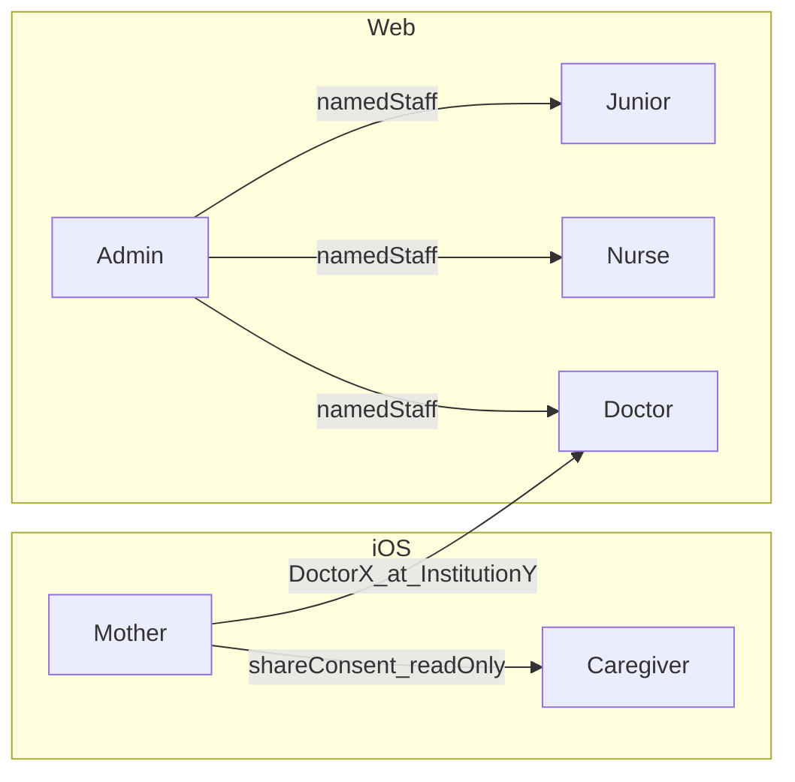

## 2. Penpot page map

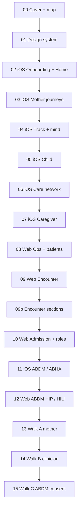

## 3. Mother iOS — auth and onboarding

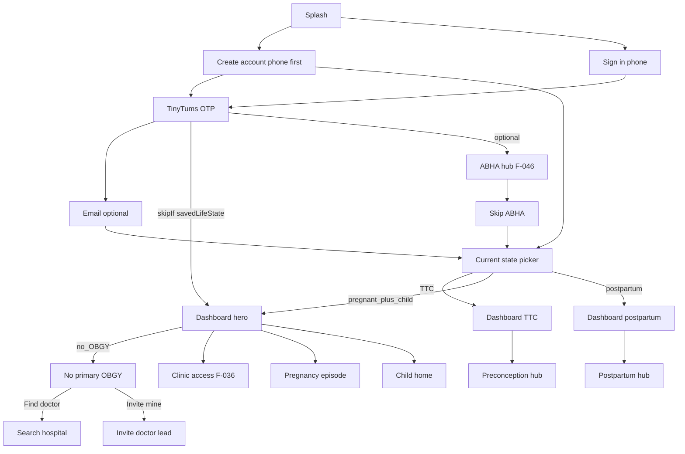

## 4. Mother record, tracking, mind

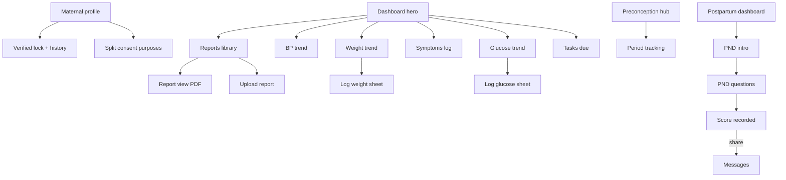

## 5. Child profile — own person

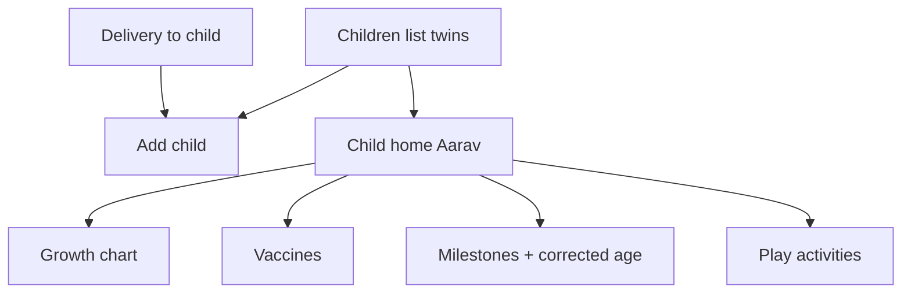

## 6. Care network and visit

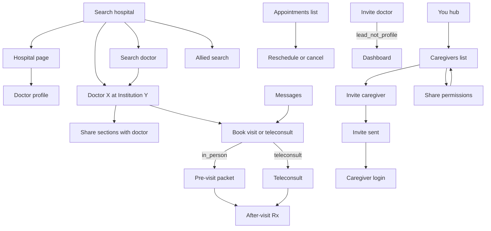

## 7. Caregiver iOS

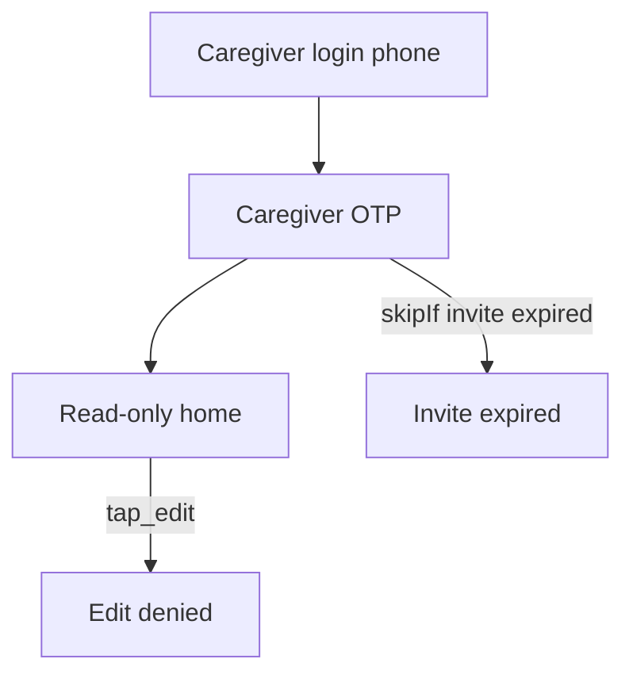

## 8. Web portal — auth workspace ops

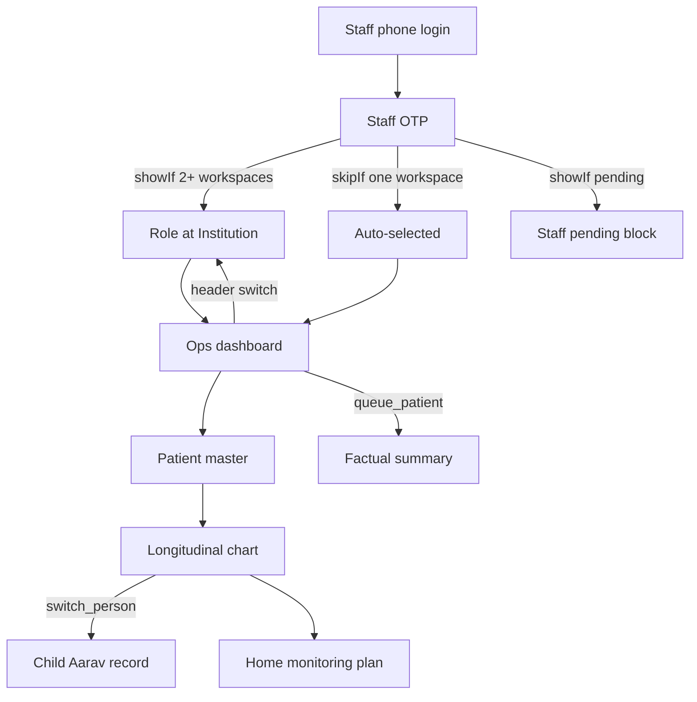

## 9. Encounter and verification

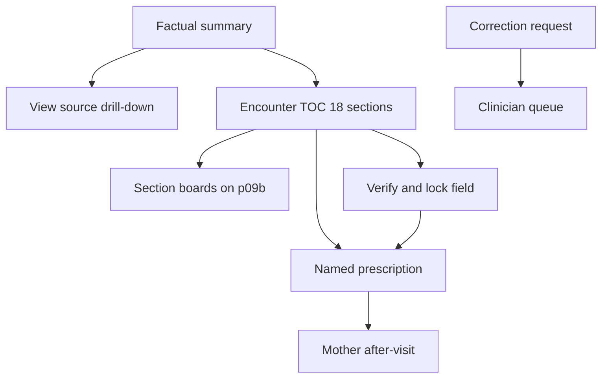

## 10. Admission and roles

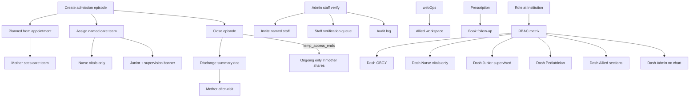

## 11. Prototype walks in Penpot Play

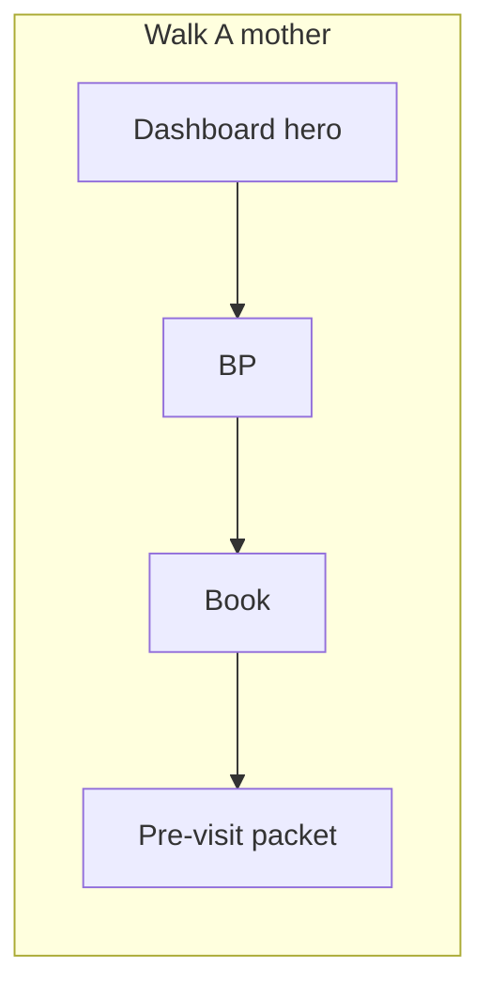

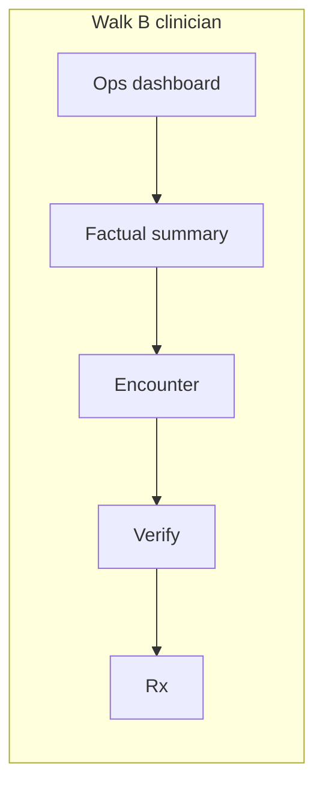

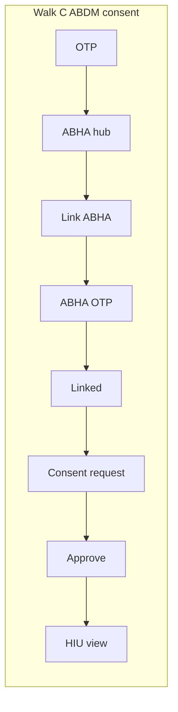

## 12. ABDM iOS — PHR consent

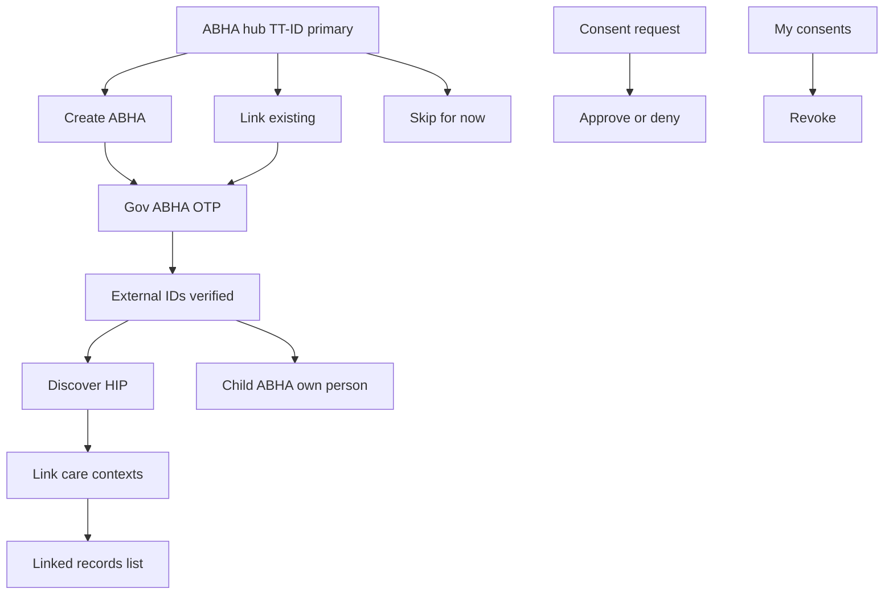

## 13. ABDM web — HIP HIU

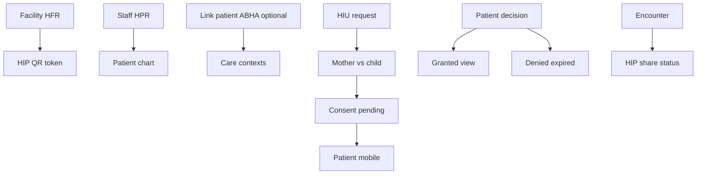

## 14. New flows (Sep 2026)

### Institution + staff onboarding
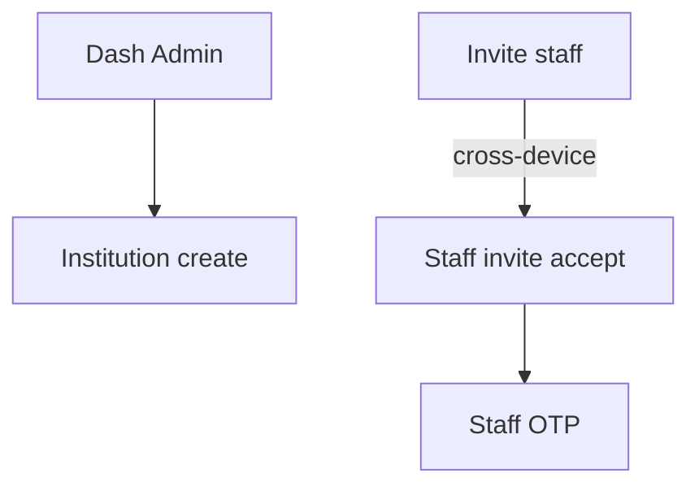

### Subscription entitlement
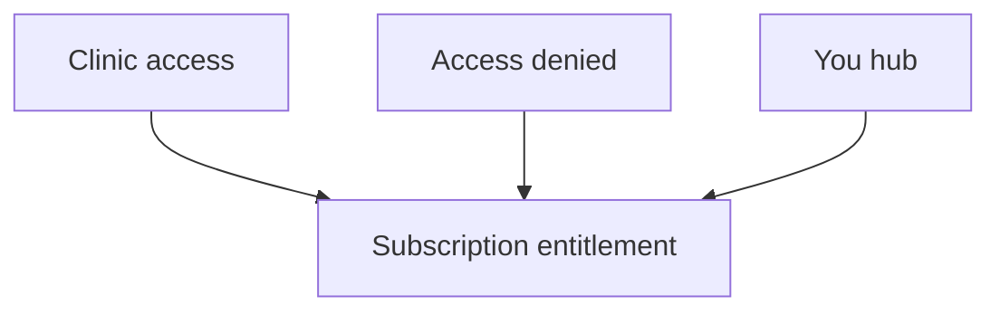

### Teleconsult in-call
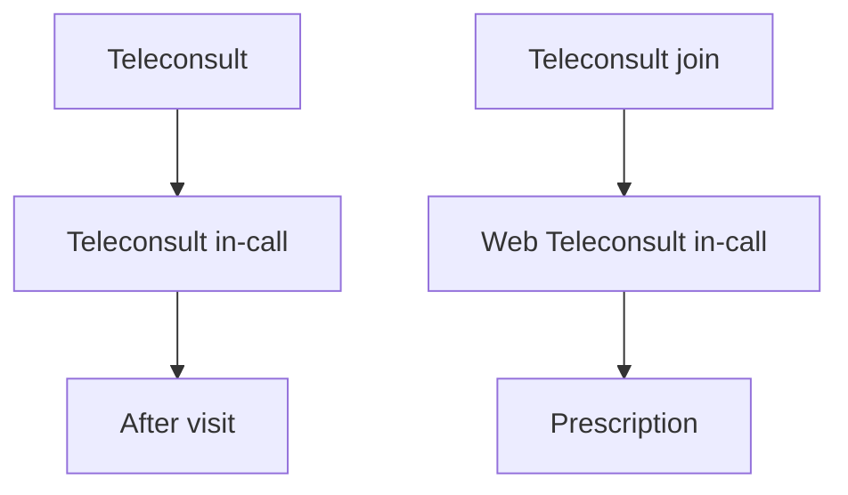

### Caregiver granular sections
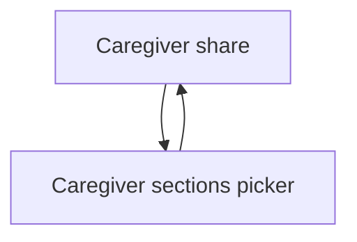

### Twin delivery + corrected age
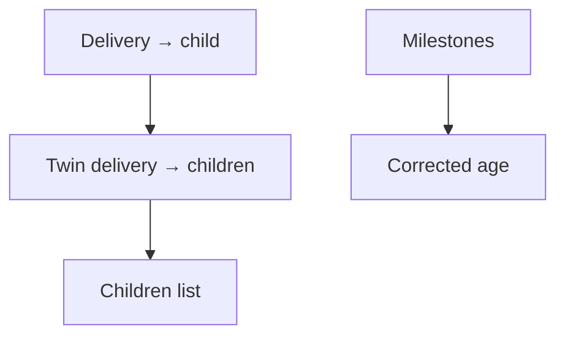

### Postpartum breastfeeding + family planning
```mermaid
flowchart TD
  iosPphub[Postpartum hub] --> iosBreastfeed[Breastfeeding log]
  iosPphub --> iosFamilyPlan[Family planning]
```

### Sensitive outcome
```mermaid
flowchart TD
  iosPregnancyLoss[Pregnancy loss state] --> iosSensitiveOutcome[Sensitive outcome]
  iosState[State picker] --> iosSensitiveOutcome
```

### Ward transfer + readmission
```mermaid
flowchart TD
  webAdmit[Admit] --> webWardTransfer[Ward transfer]
  webAdmissionChart[Admission chart] --> webWardTransfer
  webAdmit --> webReadmission[Readmission]
```

### Primary OBGY soft prompt
```mermaid
flowchart TD
  iosDashHero[Dashboard hero] -->|"showIf noPrimaryObgy"| iosObgyPrompt[Primary OBGY prompt]
  iosObgyPrompt --> iosSearchH[Search hospital]
  iosObgyPrompt --> iosInvite[Invite doctor]
  iosObgyPrompt --> iosDashHero
```

## 15. Mother Home dashboards with themed chips (Sep 2026)

Four enriched dashboards with cream/paper/rose/teal theme and aligned peach secondary chips:

### Dashboard variants
```mermaid
flowchart TD
  iosState[State picker] --> iosDashHero[Dashboard hero - pregnant]
  iosState --> iosDashTtc[Dashboard TTC]
  iosState --> iosDashPp[Dashboard postpartum]
  iosState --> iosPregnancyLoss[Pregnancy loss state]
  iosPregnancyLoss --> iosDashLoss[Dashboard pregnancy loss]
```

### Home chips → gate boards
Penpot cannot persist cross-page navigate-to. Home chips use same-page gate boards:

```mermaid
flowchart TD
  subgraph Dashboard_hero [Dashboard hero chips]
    iosDashHero[Dashboard hero] --> iosWeightGate[Weight · gate]
    iosDashHero --> iosGlucoseGate[Glucose · gate]
  end
  subgraph Dashboard_TTC [Dashboard TTC chips]
    iosDashTtc[Dashboard TTC] --> iosPreconceptionGate[Preconception · gate]
    iosDashTtc --> iosMealIdeasGate[Meal ideas · gate]
  end
  subgraph Dashboard_postpartum [Dashboard postpartum chips]
    iosDashPp[Dashboard postpartum] --> iosChildHomeGate[Child home · gate]
    iosDashPp --> iosPostpartumGate[Postpartum hub · gate]
  end
  subgraph Dashboard_loss [Dashboard pregnancy loss chips]
    iosDashLoss[Dashboard pregnancy loss] --> iosSensitiveOutcome[Sensitive outcome]
    iosDashLoss --> iosFindCareGate[Find care · gate]
  end
```

### Gate → canonical destination
```mermaid
flowchart LR
  iosPreconceptionGate[Preconception · gate] --> iosTtc[iOS / Preconception p03]
  iosMealIdeasGate[Meal ideas · gate] --> iosMealSuggest[iOS / Meal suggestions p03]
  iosPostpartumGate[Postpartum hub · gate] --> iosPphub[iOS / Postpartum hub p03]
  iosChildHomeGate[Child home · gate] --> iosChildHome[iOS / Child home p05]
  iosWeightGate[Weight · gate] --> iosWeight[iOS / Weight p04]
  iosGlucoseGate[Glucose · gate] --> iosGlucose[iOS / Glucose p04]
  iosFindCareGate[Find care · gate] --> iosSearchH[iOS / Search hospital p06]
```

## 16. Postpartum hub restacked (Sep 2026)

Cards evenly spaced (68px tall, 12px gap). Tap targets:

```mermaid
flowchart TD
  iosPphub[Postpartum hub] --> iosRecoverySymptoms[Recovery & symptoms]
  iosPphub --> iosMealSuggest[Nutrition & weight → Meal suggestions]
  iosPphub --> iosTtc[Menstrual return → Preconception]
  iosPphub --> iosBreastfeed[Breastfeeding support → Breastfeeding log]
  iosPphub --> iosFamilyPlan[Contraception / future planning → Family planning]
```

## 17. Extended scope (F-037, F-038, F-039, F-045, F-047)

Badges: `future` | `aiAssist` | `regulatoryHold` | `amber`

### Pregnancy summary (generated) — F-037
```mermaid
flowchart TD
  iosPreg[Pregnancy episode] --> iosPregSummaryGen["Pregnancy summary (generated) 🤖"]
  iosPphub[Postpartum hub] --> iosPregSummaryGen
  iosPregSummaryGen --> iosReportView[View source]
```

### Meal suggestions — F-038
```mermaid
flowchart TD
  iosTtc[Preconception] --> iosMealSuggest["Meal suggestions 🔮"]
  iosPphub[Postpartum hub] --> iosMealSuggest
```

### Micronutrient tracking — F-039
```mermaid
flowchart TD
  iosYou[You hub] --> iosMicroTrack["Micronutrient tracking 🔮"]
```

### Blood investigations tracker — F-047
```mermaid
flowchart TD
  iosReports[Reports library] --> iosBloodLabs["Blood labs tracker 🟡"]
  iosBloodLabs --> iosReportView[View source]
```

### Regulated AI hold gate — F-045
```mermaid
flowchart TD
  iosYou[You hub] --> iosAiHold["Regulated AI hold ⏸️"]
  iosAiHold --> iosYou
  webOps[Ops dashboard] --> webAiHold["Web Regulated AI hold ⏸️"]
  webAiHold --> webOps
```

## 18. V1 fence

```mermaid
flowchart LR
  v1[V1 allowed: store display trends factual_summary teleconsult consent verify]
  v2[V2 held: auto_flag triage diagnosis risk treatment]
  v1 -.->|regulatory_gate| v2
```
